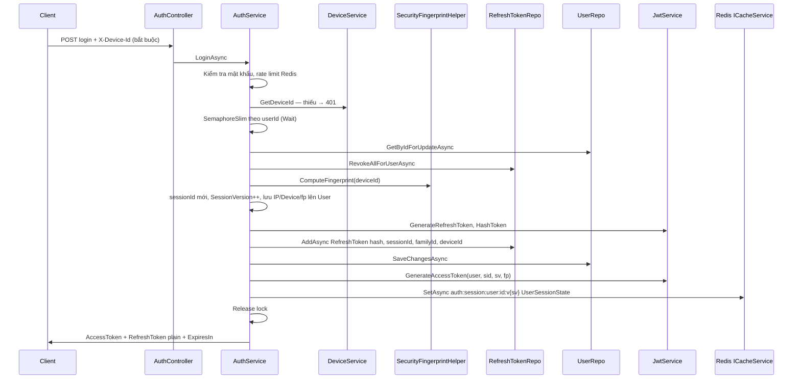
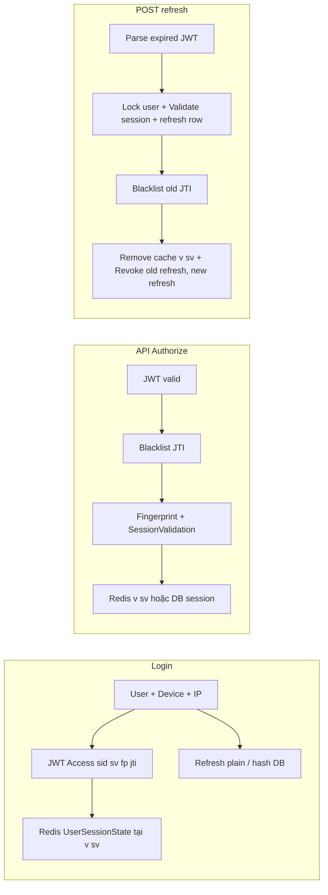

# Phân tích hệ thống xác thực: Access Token & Refresh Token

Tài liệu mô tả luồng và file liên quan trong codebase **Ecommerce_API_ver0** (stateful JWT, fingerprint, Redis, rotation refresh, **session cache theo phiên bản `sv`**).

---

## 1. Danh sách file tham gia quản lý Access / Refresh Token

| Lớp | File | Vai trò tóm tắt |
|-----|------|-----------------|
| **API** | `AuthController.cs` | Endpoint `login`, `refresh`, `logout`; gọi `IAuthService`. |
| **API** | `Program.cs` | Cấu hình JWT Bearer; pipeline `UseAuthentication` → `SessionValidationMiddleware` → `UseAuthorization`; Swagger header `X-Device-Id`. |
| **API** | `Middleware/SessionValidationMiddleware.cs` | Sau JWT hợp lệ: kiểm tra claim session, blacklist JTI, fingerprint, gọi `SessionValidationService`. |
| **Application** | `Services/Implementations/AuthService.cs` | Login, refresh, logout; **lock theo user** (`SemaphoreSlim`); tạo token, rotation refresh, blacklist access cũ, cập nhật user + cache session **theo key có `v{sv}`**. |
| **Application** | `Services/Implementations/SessionValidationService.cs` | Đối chiếu `sid` / `sv` / `fp`; Redis key **`auth:session:user:{userId}:v{sv}`** hoặc DB (`UserAuthState`). |
| **Application** | `Common/Auth/UserSessionState.cs` | DTO trạng thái phiên lưu Redis. |
| **Application** | `Common/Caching/CacheKeyGenerator.cs` | Key Redis: **AuthSession(userId, sessionVersion)**, blacklist, login fail. |
| **Application** | `Services/Interfaces/ICacheService.cs` | Abstraction cache (session, blacklist, rate limit login). |
| **Domain** | `Interfaces/IJwtService.cs` | Contract tạo access token, refresh random, đọc token hết hạn, hash, TTL còn lại. |
| **Domain** | `Interfaces/IUserRepo.cs` | `GetUserAuthStateAsync` — snapshot phiên từ DB. |
| **Domain** | `Interfaces/IRefreshTokenRepo.cs` | Lưu / tra cứu / revoke refresh token. |
| **Domain** | `Entities/RefreshToken.cs` | Entity: hash refresh, `SessionId`, `FamilyId`, `DeviceId`, `IsRevoked`, hạn dùng. |
| **Domain** | `Entities/User.cs` | `SessionVersion`, `CurrentSessionId`, `LastFingerprintHash`, `LastDeviceIdHash` (HMAC device binding). |
| **Domain** | `Common/UserAuthState.cs` | Record trả về từ DB cho validation. |
| **Domain** | `Common/Settings/JwtSettings.cs` | Thời hạn access, refresh (config). |
| **Infrastructure** | `SecurityHelpers/JwtService.cs` | Ký JWT access; claims `sid`, `sv`, `fp`, `jti`, role, permissions; parse token hết hạn cho refresh. |
| **Infrastructure** | `SecurityHelpers/SecurityFingerprintHelper.cs` | IP (X-Forwarded-For / RemoteIp); `fp` = HMAC-SHA256(secret, `deviceId\|ip`). |
| **Infrastructure** | `Services/DeviceService.cs` | Đọc header `X-Device-Id`. |
| **Infrastructure** | `Services/TokenBlacklistService.cs` | Redis key `Blacklist:Token:{jtiHash}`. |
| **Infrastructure** | `RedisCaching/RedisCacheService.cs` | Triển khai `ICacheService`; lỗi Redis → soft-fail (trả default). |
| **Infrastructure** | `Repositories/RefreshTokenRepo.cs` | EF: thêm token, tìm theo hash (kể cả revoked), revoke. |
| **Infrastructure** | `Repositories/UserRepo.cs` | `GetUserAuthStateAsync` → `UserAuthState`. |
| **Application** | `DTOs/Auth/AuthResponseDto.cs`, `DTOs/Common/RefreshTokenRequestDto.cs` | Request/response login & refresh. |

---

## 2. Tác dụng từng nhóm (token)

- **AuthService**: Orchestration — đăng nhập, làm mới, đăng xuất; **chuỗi hóa thao tác theo user** bằng `SemaphoreSlim` (tránh tạo session/refresh trùng khi request song song); đồng bộ User, RefreshToken, cache session (key có `sv`), blacklist access cũ khi refresh/logout.
- **JwtService**: Tạo access JWT (claims + HMAC-SHA256); sinh refresh ngẫu nhiên; đọc access đã hết hạn (bỏ qua lifetime) để lấy `userId`, `sid`, `sv`, `fp`, `jti`.
- **SessionValidationMiddleware**: Mọi request `[Authorize]` phải có token đủ `sid`/`sv`/`fp`, không nằm blacklist JTI, fingerprint khớp claim, session khớp Redis hoặc DB.
- **SessionValidationService**: So khớp phiên; đọc Redis với key **`AuthSession(userId, sv)`**; miss hoặc lỗi đọc cache → DB.
- **SecurityFingerprintHelper + DeviceService**: Tính fingerprint hiện tại từ `X-Device-Id` + IP request.
- **TokenBlacklistService**: Lưu JTI đã thu hồi (TTL = phần còn lại của access token).
- **RedisCacheService**: Get/Set/Remove; **không throw** khi Redis lỗi → caller xử lý như miss hoặc “chưa blacklist”.
- **RefreshTokenRepo / RefreshToken**: Lưu **hash** refresh (không plaintext); rotation = revoke bản cũ + thêm bản mới cùng `FamilyId`.
- **UserRepo / User / UserAuthState**: Trạng thái phiên trên DB khi không có / không tin cache.
- **AuthController**: HTTP mỏng, không chứa logic token.

---

## 3. Claims JWT (không có `iph` / `did` trong JWT)

Trong code **không** có claim `iph` hay `did`.

| Claim | Ý nghĩa |
|-------|---------|
| `sid` | `CurrentSessionId` (Guid phiên). |
| `sv` | `SessionVersion` — **đồng thời là hậu tố phiên bản trong key Redis session**. |
| `fp` | HMAC-SHA256(secret, `deviceId\|ip`) — gói thiết bị + IP. |
| `jti` | Id access token (blacklist). |
| `sub` / `NameIdentifier` | User id. |

Trên **User** (DB): `LastDeviceIdHash` (HMAC của `deviceId` với `DeviceBindingSecret`), `LastFingerprintHash` (HMAC `deviceId|ip` với `FingerprintSecret`) dùng khi đồng bộ / kiểm tra phiên.

---

## 4. Redis session key (cache versioning cho phiên)

- **Key**: `auth:session:user:{userId}:v{sessionVersion}` — `sessionVersion` = giá trị claim **`sv`** (= `User.SessionVersion` tại thời điểm phát token).
- **Ghi** (`CacheSessionAsync`): sau khi đã có `user.SessionVersion` mới (ví dụ sau login: `SessionVersion++`).
- **Đọc** (`SessionValidationService`): parse `sv` từ token → dựng đúng key.
- **Xóa** (logout / invalidate / trước khi ghi session mới khi refresh): dùng **`AuthSession(userId, oldSv)`** — `oldSv` là phiên bản **trước** khi tăng `SessionVersion` (logout, reuse) hoặc **`sessionVersionClaim` từ JWT** (refresh: xóa entry đúng với access đang dùng).

---

## 5. Luồng cấp phát (Login thành công)



**Tóm tắt bước:**

1. Xác thực credential; đếm sai qua Redis (`auth:loginfail:...`).
2. **Bắt buộc** `X-Device-Id`; tính `fingerprintHash` = HMAC(deviceId + IP).
3. **Khóa theo user** (`SemaphoreSlim`): một luồng xử lý revoke + cập nhật user + refresh + JWT + cache cho mỗi user tại một thời điểm.
4. Tăng `SessionVersion`, gán `CurrentSessionId`, cập nhật `Last*` trên User.
5. Refresh: plaintext ngẫu nhiên cho client; DB chỉ lưu **hash**.
6. Access JWT: `sub`, `jti`, `sid`, `sv`, `fp`, role, permissions; hết hạn theo `Jwt:ExpiryMinutes`.
7. Ghi `UserSessionState` vào Redis với key **`auth:session:user:{userId}:v{sv}`**.

---

## 6. Luồng xác thực (Middleware + Bearer + X-Device-Id)

Thứ tự: **JWT Bearer** (chữ ký, hạn, issuer/audience) → **SessionValidationMiddleware** (khi `IsAuthenticated`).

```mermaid
flowchart TD
    A[Request có Authorization Bearer] --> B{JWT hợp lệ?}
    B -->|Không| Z[JwtBearer 401]
    B -->|Có| C{Đủ sid, sv, fp?}
    C -->|Không| U401[Token invalid or outdated]
    C -->|Có| D{JTI trong blacklist Redis?}
    D -->|Có| U401b[Token revoked]
    D -->|Không / Redis lỗi*| E[ComputeFingerprint từ X-Device-Id + IP]
    E --> F[EnsureAccessTokenSessionValidAsync]
    F --> G{fp request == fp claim?}
    G -->|Không| U401c[Fingerprint mismatch]
    G -->|Có| H{Redis có UserSessionState tại key v{sv}?}
    H -->|Có và khớp sid/sv/fp| OK[next]
    H -->|Miss hoặc lỗi đọc*| I[Đọc UserAuthState DB]
    I --> J{Khớp sid/sv/LastFingerprintHash?}
    J -->|Có| OK
    J -->|Không| U401d[Invalid session]
```

| Bước | Nội dung |
|------|-----------|
| Blacklist | `TokenBlacklistService` → `IsBlacklistedAsync(jtiHash)`. |
| Fingerprint | Trong `SessionValidationService`: `currentFingerprint != fpClaim` → 401. |
| Session | Redis: key **`auth:session:user:{userId}:v{sv}`**. DB: `CurrentSessionId`, `SessionVersion`, `LastFingerprintHash`. |
| Redis fallback | `GetAsync` lỗi → `default` → coi như miss → **đọc DB**. |

\* **Trade-off:** Redis lỗi có thể khiến blacklist **không** chặn JTI (ưu tiên availability).

---

## 7. Luồng làm mới (Refresh) và vô hiệu hóa token cũ

1. Client gửi access **đã hết hạn** (vẫn parse được) + refresh plaintext (`RefreshTokenRequestDto`).
2. `GetPrincipalFromExpiredToken` — không validate lifetime; lấy `userId`, `sid`, `sv`, `fp`, `jti`.
3. Parse `sv` thành số (`sessionVersionClaim`) — dùng cho bước xóa cache.
4. `EnsureAccessTokenSessionValidAsync` — fingerprint + Redis (key `v{sv}`) / DB.
5. **`SemaphoreSlim` theo `userId`** — `Wait` trước khi thao tác refresh token + DB + cache.
6. Hash refresh → `GetByTokenHashAnyAsync`.
7. **Reuse:** Nếu row **đã revoked** → `InvalidateAllUserSessionsAsync` (tăng `SessionVersion`, xóa cache `v{oldSv}`) → 401 “reuse detected”.
8. Kiểm tra `UserId`, `SessionId`, `ExpiryDate`.
9. Có `jti` và access còn TTL > 0 → `BlacklistAsync(jtiHash, remaining)`.
10. **`RemoveAsync(AuthSession(userId, sessionVersionClaim))`** — xóa đúng entry session của access cũ.
11. `RevokeById` refresh cũ; tạo refresh mới (cùng `FamilyId`, **cùng `sessionId`**); cập nhật User (`Last*`); **`SessionVersion` không đổi** trong luồng refresh bình thường.
12. Phát access JWT mới (cùng `sv`); `CacheSessionAsync` ghi lại Redis tại **`v{sv}`**.

**Ghi chú `X-Device-Id`:** Login bắt buộc; Refresh dùng `deviceId ?? string.Empty` — nên client vẫn nên gửi header để fingerprint khớp môi trường thực tế.

**Vô hiệu hóa:**

- **Access cũ:** blacklist theo **JTI** (Redis, TTL = thời gian còn lại).
- **Refresh cũ:** revoke row trong DB.
- **Logout:** có thể blacklist JTI (nếu parse được access) + revoke all refresh + tăng `SessionVersion` + **`RemoveAsync(AuthSession(userId, oldSessionVersion))`**.

---

## 8. Redis, DB và fail-fast IP / Device

| Khái niệm | Trong code |
|-----------|------------|
| Gắn thiết bị + mạng | Claim **`fp`** = HMAC(secret, `deviceId\|ip`). |
| Fail-fast sai IP/Device | `currentFingerprint != fpClaim` → `UnauthorizedException`. |
| Redis | Session theo **`v{sv}`**, blacklist JTI, rate limit login. |
| DB | Nguồn khi cache miss hoặc Redis không đọc được. |
| Soft-fail Redis | Đọc lỗi → fallback DB cho session; blacklist có thể bỏ sót khi Redis down. |

---

## 9. Sơ đồ tổng quan



---

*Tài liệu tham chiếu mã nguồn: `AuthService`, `JwtService`, `SessionValidationMiddleware`, `SessionValidationService`, `TokenBlacklistService`, `RedisCacheService`, `CacheKeyGenerator`, `RefreshTokenRepo`, `UserRepo`, v.v.*
